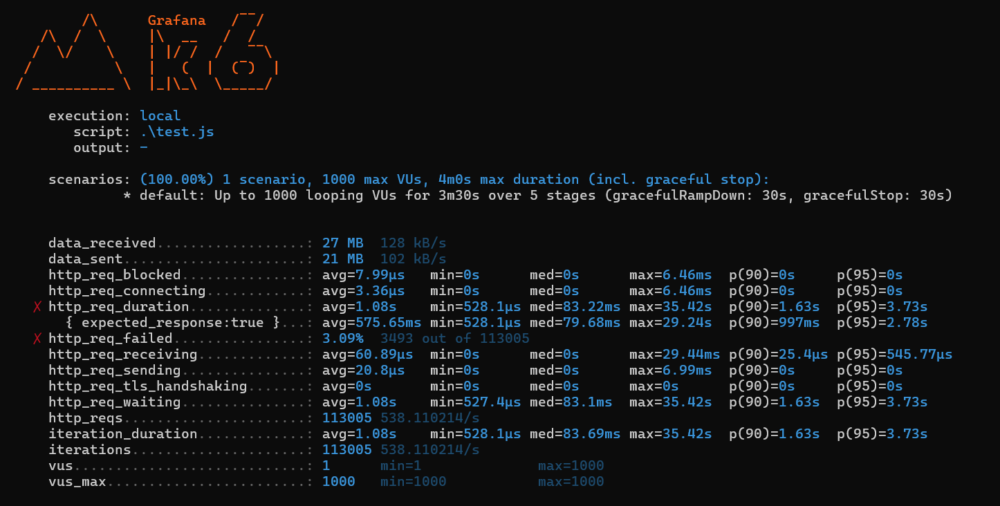

# URL Shortening Service

This is a URL shortening service built with Go and Redis. It allows you to shorten long URLs and redirect users to the original URL when they visit the shortened link.

## Features

- Shorten long URLs
- Redirect to original URLs using shortened links
- Simple and fast

## Prerequisites

- Docker
- Docker Compose

## Installation

1. Clone the repository:
    ```sh
    git clone https://github.com/yourusername/url-shorten-go-redis.git
    cd url-shorten-go-redis
    ```

2. Build and run the Docker containers:
    ```sh
    docker-compose up --build
    ```

## Usage

The service will be available at `http://localhost:8080`.

## API Endpoints

### Shorten URL

- **Endpoint:** `POST /shorten`
- **Description:** Shorten a long URL.
- **Request Body:**
    ```json
    {
        "url": "https://example.com",
        "short": "customShort", // optional
        "expiry": 24 // in hours, optional
    }
    ```
- **Response:**
    ```json
    {
        "url": "https://example.com",
        "short": "http://localhost:8080/abc123",
        "expiry": 24,
        "rate_limit": 10,
        "rate_limit_reset": 30
    }
    ```

### Redirect to Original URL

- **Endpoint:** `GET /{short_url}`
- **Description:** Redirect to the original URL.
- **Response:** Redirects to the original URL.

## Metrics



## License

This project is licensed under the MIT License. See the [LICENSE](LICENSE) file for details.


## Acknowledgements

- [Go](https://golang.org/)
- [Redis](https://redis.io/)
- [Docker](https://www.docker.com/)
